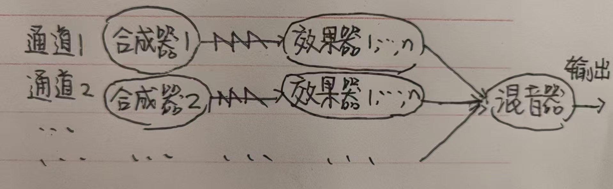
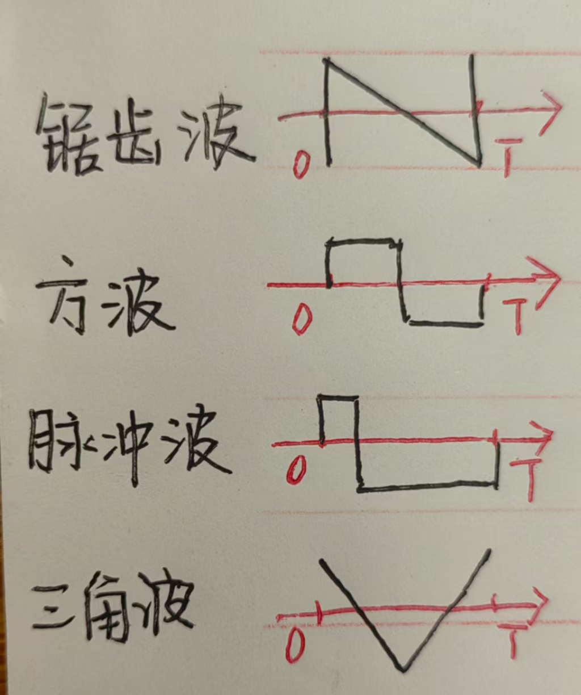
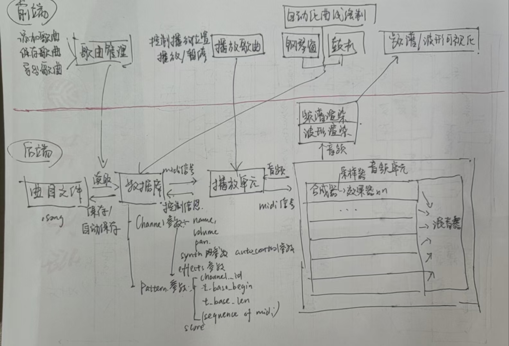
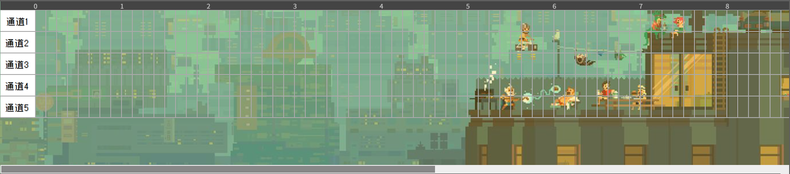
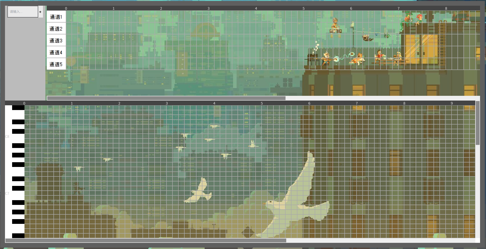
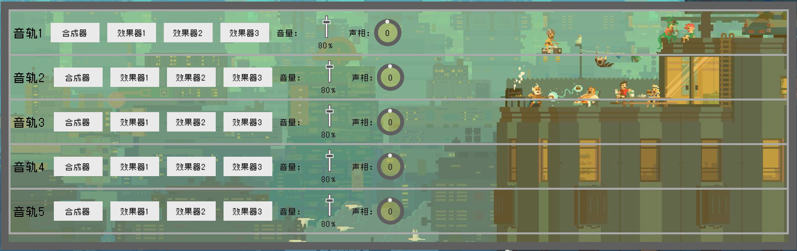
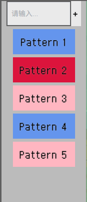
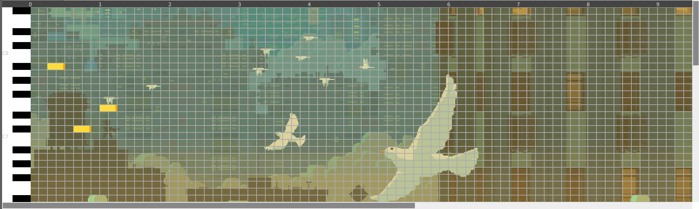
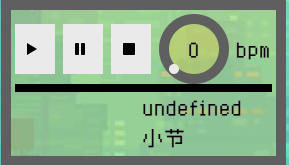

# 8bits_of_rust

一个基于Rust的**8bit音频工作站**

# 使用方法
### 安装依赖

确保你已经安装了 Rust 编译器和 `cargo`。然后在项目根目录运行以下命令安装依赖：

```bash
cargo build
```

为了编译rust为wasm，安装wasm pack工具包
```bash
cargo install wasm-pack
```

对于前端的环境，请确保安装了nodejs、npm和vue，建议使用nvm等工具来管理node和npm的版本
```bash
npm install npm@latest -g
```

### 运行程序

运行程序以生成和播放音频（记得戴上耳机，音量别太大）：

```bash
cargo run
```

程序内部存储了一首示例歌曲，该命令以[main.rs](src/main.rs)为主文件编译代码，运行后将生成一个名为 `my_wave.wav` 的音频文件，并尝试播放它。

在运行前，利用wasm-pack把代码编译成可供JavaScript使用的库。在项目根目录下执行以下命令，该命令以[lib.rs](src/lib.rs)为主文件编译：

```bash
wasm-pack build
```

之后启动前端服务：

```bash
cd frontend
npm install
npm build
npm run serve
```

### 注意事项

- 确保程序有权限访问音频设备，否则将无法正常播放声音
- 如果程序无法找到默认音频设备，请检查音频设置。


# 前置知识
### 1. 计算机是怎么记录声音的

声音是一个振动过程，计算机通过把每个时刻振动的状态**采样**并记录为一个数，形成一个数组，从而记录声音。**wav文件** 就是通过这种方式记录音频的

### 2. wav文件、采样率和位宽
1. 采样的频率被称为**采样率 sample_rate**，一般使用44100Hz的采样率。
   根据奈奎斯特采样定理，要想从采样后的数字音频中恢复真实的声音，采样频率必须为真实声音中最高频率的两倍。人耳的能听见的最高音频率约为20000Hz，因此，44100Hz是一个较低但是完全够用的采样率标准。事实上，更高的采样率对音频影响不大
2. 对声音采样一次得到的整数位数称为 **位宽 bit width**
3. **wav文件**将左右声道的数据交替排列

### 3. 什么是8bit/Chiptune音乐
在电子游戏机刚刚萌芽的时候，硬件资源极度稀缺，游戏机的内存不足，无法下载完整的音频来播放配乐。因此，为了最大限度地节省资源，游戏机必须采用实时合成音乐的方式，同时还要限制音乐的位宽。

在这种限制下，游戏配乐师和工程师反而在粗糙的制作资源中发展出了一种艺术风格独特的音乐，也就是 **8bit/Chiptune 音乐**（8bit音乐这个叫法大众知名度较高，而Chiptune音乐这个叫法更为正式）。

受制于游戏芯片的总线宽度，在最初的游戏音乐中，**8bit音乐的位宽就是8，范围是[-127,128]**。

### 4. 怎么使用计算机作曲

**在现实中**录制一段音乐，需要制作出各个乐器的乐谱（即便是即兴演奏，客观来说也能还原出演奏的乐谱），各个乐手按照乐谱演奏乐器后，录制各个乐器产生的声音，经过处理后，合并在一起，形成数字音频。在计算机中，作曲的步骤也是类似的：

**在计算机中**，一个乐器/音色被抽象为**通道/音轨**，一个音符被抽象为**midi信号**（包含音高，开始/停止演奏等信息。一对代表开始/停止演奏的midi信号就描述了一个音符）。这样，现实作曲的各个步骤就能对应到计算机操作中。

#### 1. 制作乐谱——（在钢琴窗中）编辑音符，产生midi信号流


#### 2. 演奏音乐——合成器按照midi信号流发出声音

#### 3. 处理音频——效果器修饰合成器发出的声音

#### 4. 合并音频——混音器将不同轨道的声音混合得到最终的数字音频

综上所述，使用计算机作曲并得到最终的数字音频的流程如下：
用户编辑**midi信号**——>**合成器 synthesiser**发出声音——>**效果器 effecter**修饰声音——>**混音器 mixer**将不同轨道的声音混合

等等，你怎么突然塞进来一大堆名词，它们都是什么意思？具体在干什么？别急，这就解释给你听。

### 5. 合成器、效果器、混音器

接下来，不如换一种方式理解计算机作曲的过程：**把声音类比成流水线上的产品，会经历从产生，到处理和融合等一系列的步骤**，这样，合成器、效果器、混音器的作用就好理解了。

图示：


需要额外解释的地方是：
- 一条通道中有一个合成器，可以有多个效果器
- 合成器也能内置效果器

##### 合成器 synthesiser

1. 合成器按一定的频率重复特定的波形，生成乐音
2. 合成器通过这次采样的时间计算出当前的**相位**。相位是合成器在波形中取样的位置。具体来说，每个合成器有一个相位时钟，每次需要采样时，将时钟加上**frequency/sample_rate**再**对2取余**得到当前的相位（数学证明略）
3. 合成器根据相位，结合波形算出当前时刻的振动状态，已经实现的五种波形是：**锯齿波 saw**、**方波square**、**脉冲波 spike**、**三角波 triangle**、**噪波 noise**，波形如下（噪波是随机生成的）：
   

##### 效果器 effector

效果器部分种类如下：
1. **延迟/回声 delay**：声音按照一定的频率出现并不断衰减
2. **混响 reverb**：声音反复反射，听不出每次反射的声音，但是得到模糊的效果
3. **失真 distortion**：对声音进行某种处理，为声音增加新的谐波成分，让它听起来更有力量等。这些处理可能是可能是削波，纵向拉伸，欠采样等等
4. **fm调制 fm modulate**：音高按照正弦波变化，能避免旋律呆板
5. **立体声增强 stereo enhancer**：人耳因为**左右耳听到的声音有细微差别**感受到立体声（就像立体视觉）。8bits_of_rust通过将左右声道的略微错位来增强立体声，错位程度越高，声音听起来越宽
6. **滤波器 Filter**：滤掉音频某一频段的声音

效果器可以理解为一个**函数**，它不产生声音，以当前的声音以及合成器参数作为因变量，以处理后的声音作为自变量

目前的效果器变量依然在合成器参数 `SynthesiserParameters`结构体中，用 `has_[name of effecter]`的格式的bool变量保存是否触发效果器，若触发，则用 `[name of effecter]Parameters`中的参数处理声音

##### 混音器 mixer

混音器的工作很简单，直接将各轨音频相加即可

### 6. 电脑如何记录歌曲？

在给定程序框架的话，一个歌曲文件只需要记录：
##### 乐谱
##### 合成器、效果器、混音器的参数


# DONE & <u>TODO</u>
下划线是TODO内容
## 项目结构



## 前端
- 前端基于**Vue3**，代码风格是**组合式api**，安装教程地址 https://www.runoob.com/vue3/vue3-install.html
- 在`./frontend`目录下，执行 `npm run serve` 预览前端网页
- 要修改的文件基本在`./frontend/src`中，所以文件路径都是相对`./frontend/src`而言的


### 前端项目结构

│  App.vue 主界面
│  main.js 用于导入一些组件、样式等
│  tree.txt 前端目录树结构
│  
├─assets 一些图片、字体、样式资源，还需要整理一下放到不同的文件夹中
│      bkg_pixel1.jpg 好看一点的背景图片
│      image.png 基础款背景图片
│      logo.png <u>vue的logo，记得扔掉</u>
│      qrcode.jpg 付款二维码
│      theme.css 一些基础样式，换皮肤（也就是配色）功能也在里面
│      zpix.ttf 像素风格字体文件
│      
├─components 组件
│  ├─channels 通道，编曲界面右上角
│  │      ChannelNames.vue 显示通道名称（左侧）
│  │      Channels.vue 显示通道时间轴和网格（右侧）
│  │      Displays.vue 显示通道中的Display

│  │      
│  ├─common 常用组件
│  │      ColorGenerator.js <u>生成颜色，测试中，之后可能会用上</u>
│  │      index.js
│  │      MyButton.vue 按钮组件
│  │      MyGrid.vue 网格/矩阵组件
│  │      MyInput.vue 输入框组件
│  │      MyKnob.vue 旋钮组件
│  │      MySelect.vue 下拉选择框组件
│  │      MySlider.vue 滑动条组件
│  │      MyTest.vue 测试组件
│  │      MyText.vue 文本组件
│  │      
│  ├─compose 作曲
│  │      Arrangement.vue 编曲界面，包含钢琴窗，通道，pattern管理

│  │      ExportSong.vue 导出歌曲

│  │      Mixer.vue 混音器：可以选择合成器或效果器，在插件界面中显示

│  │      Plugin.vue 插件：可以显示混音器中选择的合成器或效果器

│  │      Synth.vue 合成器
│  │      
│  ├─patterns
│  │      Patterns.vue pattern管理，编曲界面左上角

│  │      
│  ├─pianoRoll 钢琴窗，编曲界面下方
│  │      PianoKeys.vue 琴键界面：钢琴窗左侧
│  │      PianoRoll.vue 钢琴窗：显示时间轴和钢琴窗网格
│  │      Score.vue 乐谱：在钢琴窗上显示音符

│  │      
│  ├─playUnit
│  │      PlayUnit.vue 播放单元：显示播放、暂停、终止、bpm、小节数等歌曲信息

│  │      
│  └─songs 歌曲
│          SongsForm.vue 歌曲表单：实现新建歌曲并提交到歌曲列表的逻辑
│          SongsList.vue 歌曲列表：调取歌曲信息并用表格呈现

│          
├─macro
│      globalmacro.js 管理一些全局宏
│      
├─router
│      index.js 管理网页节点
│      
├─store
│      store.js 管理需要持久化的状态
│      
└─views 视图
        BackgroundLayer.vue 背景层，可以在这里更改背景
        Compose.vue 作曲
        Developers.vue 开发者

        NavigationBar.vue 导航栏
        Songs.vue 歌曲管理
        Start.vue 开始界面（考虑取消）
        
### Features & TODO
- 插件分页
  - 合成器 
  - <u>效果器</u>
  - 采样器
- 混音器
  - 显示5条音轨，<u>一条音轨能挂载3个效果器，支持移动顺序
  - 点击插件能够将插件分页显示的内容变更为对应的插件</u>
  - 每条音轨单独调节音量、声相
- 编曲
  - Pattern管理：
    - 在输入框中输入新的Pattern名称（也可以不输入，采用默认名称），点击加号新建
    - 左键点击选中pattern
    - 右键点击，经确认后删除Pattern、将放置到对应的轨道上
    - 双击重命名Pattern，在出现的输入框中输入新名字，按enter重命名，按esc或者右键点击pattern取消重命名
    - 左键按住pattern可以上下拖拽排序
  - 通道：在通道中显示pattern,一个"显示"称为一个Display
    - 左键将选中的Pattern，再点击通道中的特定位置，即放入轨道中,显示对应颜色的Display
    - 右键将轨道中的Display删除
    - 拖动Display改变Display位置
    - 拖动Display末尾改变长度
  - 钢琴窗：
    - 点按对应的Pattern，可以编辑音符
    - 左键点击空白处绘制音符，右键点击音符删除之
    - 拖动音符改变音符位置
    - 拖动音符末尾改变长度
    - <u>框选多个音符拖拽移动、Ctrl + C复制和 Delete删除</u>

**Songs**
- 歌曲列表
  - 显示用户所有的歌曲，包含序号、歌曲名称、创建时间
  - 列表最后一列有删除歌曲按钮
  - <u>点击歌曲可以进入该歌曲的作曲界面</u>
- 歌曲表单提交
  - 输入歌曲名称，创建新歌曲，储存在歌曲列表中

**Developers** 略

### 像素风格组件：

- MyText：文本组件
- MyInput：输入框组件
- MyButton：按钮组件
- MyKnob：旋钮组件
- MySlider：滑动条组件
- MySelect：下拉选择框组件
- MyGrid：矩阵组件
- MyTest：测试组件

#### 音频文件分析和可视化

1. <u>频谱可视化：实时显示歌曲频谱图
2. 波形可视化：每隔一小段时间，将当前播放的波形显示出来`</u>

## 后端

#### 模式 pattern

1. 模式中的一系列音符可以移动到不同的位置，也便于复制相同的音符
2. 模式中有琶音器

#### 合成器

1. 更多波形类型（例如自定义波形）

- 在 `wave_generator` 函数中添加新的波形生成逻辑。
- 修改 `Channel` 结构体以支持新的波形类型。

2. 目前实现了基本的复音

#### 采样

1. 采样音频：在歌曲中播放一段录好的音频
2. 采样波形：可以截取wav文件的一部分波形，放在合成其中

#### 效果器

- 目前只实现了fm调制
- 在 `synth` 函数输出的通道中加入

1. 失真
2. 延迟
3. 混响
4. 立体声增强
5. 滤波

#### 通道/音轨

1. 通道输出功能增强
2. 通道能加入/删除效果器并调整效果器顺序
3. 每个通道可以处理该音轨的音量、声相

#### 参数输入

1. 参数独立
   将决定一首歌的所有参数独立于程序，储存到单独的文件中，目前的参数都在文件中
2. 音频文件版本控制
   每隔固定时间备份音频文件，备份总量有限制
3. 参数随时间变化

#### 音频输出

1. 实时音频预览

- 创建一个实时音频播放模块。
- 在音频生成过程中直接将音频数据发送到播放模块。

2. 音频文件格式转换

- 支持其他音频格式，如 MP3、OGG 等。
- 添加一个音频格式转换模块，使用音频编码库（如 `hound`、`libogg`）实现音频格式转换。

3. 音频文件元数据编辑

- 用户可以在导出的音频中添加标题、作者、专辑等信息。
- 添加一个元数据编辑模块，使用音频元数据编辑库（如 `metaflac`）

4. <u>可以选择不同的渲染位宽，默认8bit，需要在相关函数引入泛型</u>

# 测试 & 日志
为了方便直接在浏览器预览网页界面时调试wasm-pack的行为，使用gloo console的日志实现进行测试。每次测试只需要：

   1. 在后端代码中加入测试语句，例如
   ```
   use gloo_console::log;
   pub fn my_function():
     log!(“输出任何你想输出的东西！”)
   ```
   2. 在项目根目录中，重新编译wasm-pack
   ```
   wasm-pack build
   ```
   3. 打开前端网页，进行相关操作就能在浏览器console中看到日志语句；若你已经打开了前端网页，不需要把已经打开的网页关闭，在第2步后直接操作网页就能看到日志语句
   ```
   cd frontend
   npm run serve
   ```

<u>还需要找一种方法设置日志分级等，让日志更易用</u>
